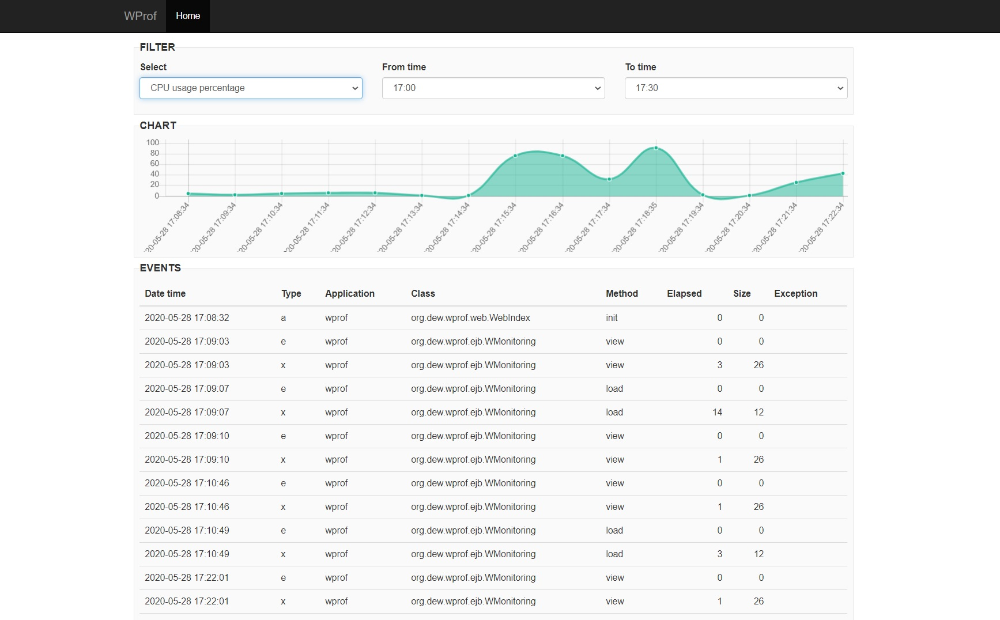

# WProf

A simple profiler and monitoring webapp.

## Data files

*wmon_sys.csv*: system usage data

- TIMESTAMP (YYYY-MM-DD HH:MI:SS)
- CUP_USAGE%
- MEM_USAGE%
- DISK_USAGE%

*wmon_jvm.csv*: JVM usage

- TIMESTAMP (YYYY-MM-DD HH:MI:SS)
- METASPACE_USED
- METASPACE_MAX
- HEAP_EDEN_USED
- HEAP_EDEN_MAX
- HEAP_SURVIVOR_USED
- HEAP_SURVIVOR_MAX
- HEAP_TENURED_USED
- HEAP_TENURED_MAX
- CODE_CACHE_USED
- CODE_CACHE_MAX
- LOADED_CLASS_COUNT
- TOTAL_LOADED_CLASS_COUNT
- UNLOADED_CLASS_COUNT
- THREAD_COUNT
- PEAK_THREAD_COUNT
- TOTAL_STARTED_THREAD_COUNT

*wmon_evn.csv*: application events

- TIMESTAMP (YYYY-MM-DD HH:MI:SS)
- EVENT_TYPE (a=application, e=entering, x=exiting, i=invocation external service, r=return external service)
- APPLICATION_NAME
- CLASS_NAME
- METHOD_EVENT
- ELAPSED ms
- RESULT_SIZE
- EXCEPTION

## Build

- `git clone https://github.com/giosil/wprof.git`
- `mvn clean install`
- `docker build -t wprof .` - this will create a Docker image named wprof
- `docker run --rm -it -p 8080:8080 --name=cwprof wprof` - To run image named wprof (container named cwprof)
- `docker exec -it cwprof bash` - To connect to the container CTRL+Z to exit

## Run on http://localhost:8080/wprof

## Contributors

* [Giorgio Silvestris](https://github.com/giosil)
